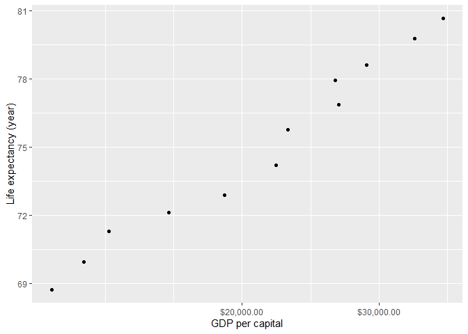
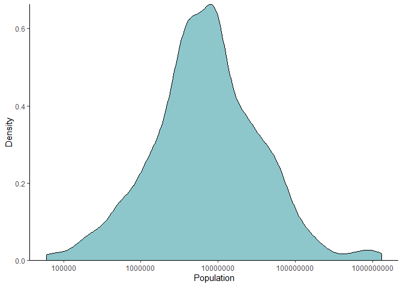
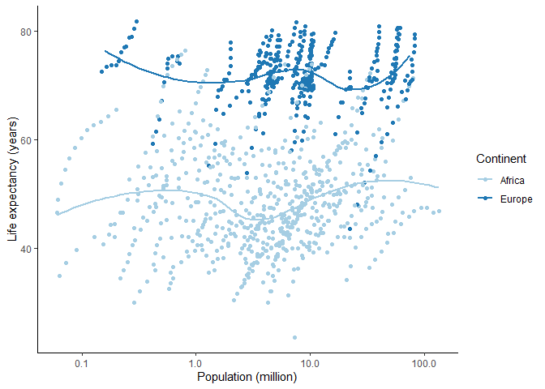
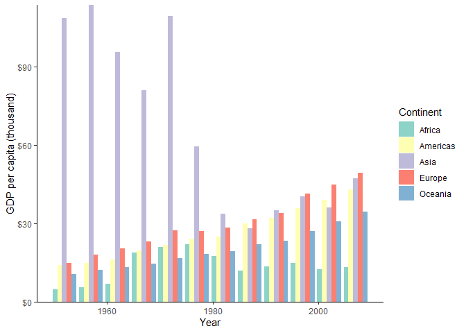

hw\_02
================
Qi Yang
2019/9/23

## Exercise 1: Basic `dplyr`

### 1.1 Subseting gapminder to three countries in the 1970’s with `filter()`.

``` r
gapminder %>%
  filter(year > 1969 & year < 1980,
         country == "Italy" | country == "Australia" | country == "Mexico")
```

    ## # A tibble: 6 x 6
    ##   country   continent  year lifeExp      pop gdpPercap
    ##   <fct>     <fct>     <int>   <dbl>    <int>     <dbl>
    ## 1 Australia Oceania    1972    71.9 13177000    16789.
    ## 2 Australia Oceania    1977    73.5 14074100    18334.
    ## 3 Italy     Europe     1972    72.2 54365564    12269.
    ## 4 Italy     Europe     1977    73.5 56059245    14256.
    ## 5 Mexico    Americas   1972    62.4 55984294     6809.
    ## 6 Mexico    Americas   1977    65.0 63759976     7675.

### 1.2 Selecting “country” and “gdpPercap” from 1.1 with `%>%`.

``` r
gapminder %>%
  filter(year > 1969 & year < 1980,
         country == "Italy" | country == "Australia" | country == "Mexico") %>% 
  select(country, gdpPercap)
```

    ## # A tibble: 6 x 2
    ##   country   gdpPercap
    ##   <fct>         <dbl>
    ## 1 Australia    16789.
    ## 2 Australia    18334.
    ## 3 Italy        12269.
    ## 4 Italy        14256.
    ## 5 Mexico        6809.
    ## 6 Mexico        7675.

### 1.3 Adding variable `lifeExpInc` to show filtered entries that have experienced drops in life expectancy with `lag()`.

``` r
gapminder %>%
  mutate(lifeExpInc = lifeExp-lag(gapminder$lifeExp,1)) %>% 
  filter(lifeExpInc < 0, year != 1952) %>% 
  select(lifeExpInc, everything()) %>% 
  arrange(lifeExpInc)
```

    ## # A tibble: 102 x 7
    ##    lifeExpInc country      continent  year lifeExp       pop gdpPercap
    ##         <dbl> <fct>        <fct>     <int>   <dbl>     <int>     <dbl>
    ##  1     -20.4  Rwanda       Africa     1992    23.6   7290203      737.
    ##  2     -13.6  Zimbabwe     Africa     1997    46.8  11404948      792.
    ##  3     -11.0  Lesotho      Africa     2002    44.6   2046772     1275.
    ##  4     -10.4  Swaziland    Africa     2002    43.9   1130269     4128.
    ##  5     -10.2  Botswana     Africa     1997    52.6   1536536     8647.
    ##  6      -9.10 Cambodia     Asia       1977    31.2   6978607      525.
    ##  7      -7.43 Namibia      Africa     2002    51.5   1972153     4072.
    ##  8      -6.87 South Africa Africa     2002    53.4  44433622     7711.
    ##  9      -6.82 Zimbabwe     Africa     2002    40.0  11926563      672.
    ## 10      -6.05 China        Asia       1962    44.5 665770000      488.
    ## # ... with 92 more rows

### 1.4 Adding `gdpPercapMax` to show the max GDP per capita experienced by each country with `max()`.

``` r
gapminder %>% 
  group_by(country) %>% 
  filter(gdpPercap == max(gdpPercap)) %>% 
  rename(gdpPercapMax = gdpPercap) %>% 
  select(gdpPercapMax, country) %>% 
  arrange(desc(gdpPercapMax))
```

    ## # A tibble: 142 x 2
    ## # Groups:   country [142]
    ##    gdpPercapMax country         
    ##           <dbl> <fct>           
    ##  1      113523. Kuwait          
    ##  2       49357. Norway          
    ##  3       47143. Singapore       
    ##  4       42952. United States   
    ##  5       40676. Ireland         
    ##  6       39725. Hong Kong, China
    ##  7       37506. Switzerland     
    ##  8       36798. Netherlands     
    ##  9       36319. Canada          
    ## 10       36181. Iceland         
    ## # ... with 132 more rows

### 1.5 Scatter plot: Canada’s life expectancy vs. GDP per capita.

<!-- -->

## Exercise 2: Explore individual variables with `dplyr`

  - Categorical variable: **country**.  
  - Quantitative variable: **pop** (population).

### 2.1 Possible values/range

**country**:

  - The number of different countries:

<!-- end list -->

``` r
gapminder %>% 
  select(country) %>% 
  unique() %>% 
  nrow()
```

    ## [1] 142

So there are 142 different possible values. Since the space is limited,
let’s just see the first and last few values (arranged alphabetically).

  - The first few values:

<!-- end list -->

``` r
gapminder %>% 
  select(country) %>% 
  unique() %>% 
  head()
```

    ## # A tibble: 6 x 1
    ##   country    
    ##   <fct>      
    ## 1 Afghanistan
    ## 2 Albania    
    ## 3 Algeria    
    ## 4 Angola     
    ## 5 Argentina  
    ## 6 Australia

  - The last few values:

<!-- end list -->

``` r
gapminder %>% 
  select(country) %>% 
  unique() %>% 
  tail()
```

    ## # A tibble: 6 x 1
    ##   country           
    ##   <fct>             
    ## 1 Venezuela         
    ## 2 Vietnam           
    ## 3 West Bank and Gaza
    ## 4 Yemen, Rep.       
    ## 5 Zambia            
    ## 6 Zimbabwe

**pop**:

  - The range:

<!-- end list -->

``` r
gapminder %>% 
  select(pop) %>% 
  range()
```

    ## [1]      60011 1318683096

### 2.2 Typical values, spread and distribution

#### 2.2.1 Before we explore the data, we need to know:

  - Measures of *typical values*: mostly *mean* or *median*.

  - Measures of *spread*: *range* (see 2.1), *quartiles*, *interquartile
    range*, *variance* and *standard deviation*.

(These two types of measures above might not apply to a categorical
variable, which in our case is **country**, so we will only talk about
these measures of **pop**)

  - *Distribution*: all possible values of data.

References:  
1\. [CSBSJU](http://www.physics.csbsju.edu/stats/descriptive2.html)  
2\. [Australian Bureau of
Statistics](https://www.abs.gov.au/websitedbs/a3121120.nsf/home/statistical+language+-+measures+of+spread)  
3\. [Statistics How
to](https://www.statisticshowto.datasciencecentral.com/data-distribution/)

#### 2.2.2 To start, let’s see *typical values* and *spread* of **pop**.

  - Summary (*mean*, *median* and *quartiles*):

<!-- end list -->

``` r
gapminder %>% 
  select(pop) %>% 
  summary(gapminder)
```

    ##       pop            
    ##  Min.   :     60011  
    ##  1st Qu.:   2793664  
    ##  Median :   7023596  
    ##  Mean   :  29601212  
    ##  3rd Qu.:  19585222  
    ##  Max.   :1318683096

  - *Interquartile range*:

<!-- end list -->

``` r
  IQR(gapminder$pop) # Tried to use piping in dplyr but failed, so I wrote in the orginal way.
```

    ## [1] 16791558

  - *Variance*:

<!-- end list -->

``` r
gapminder %>% 
  select(pop) %>% 
  var()
```

    ##                   pop
    ## pop 11269499041091670

(That is HUGE)

  - *Standard deviation*:

<!-- end list -->

``` r
  sd(gapminder$pop) # Tried to use piping in dplyr but failed, so I wrote in the orginal way.
```

    ## [1] 106157897

  - Let’s sum up the *typical values* and *spread* of **pop**.

  - Typical values:

| Type   | Value    |
| ------ | -------- |
| mean   | 29601212 |
| median | 7023596  |

  - Spread:

| Type                | Value                             |
| ------------------- | --------------------------------- |
| range               | lowest: 60011 highest: 1318683096 |
| quartiles           | Q1:2793664 Q2:7023596 Q3:19585222 |
| interquartile range | 16791558                          |
| variance            | 11269499041091670                 |
| standard deviation  | 106157897                         |

#### 2.2.3 Next, let’s see the *distribution*.

**country**:

``` r
gapminder %>% 
  select(country) %>% 
  count(country)
```

    ## # A tibble: 142 x 2
    ##    country         n
    ##    <fct>       <int>
    ##  1 Afghanistan    12
    ##  2 Albania        12
    ##  3 Algeria        12
    ##  4 Angola         12
    ##  5 Argentina      12
    ##  6 Australia      12
    ##  7 Austria        12
    ##  8 Bahrain        12
    ##  9 Bangladesh     12
    ## 10 Belgium        12
    ## # ... with 132 more rows

We can easily tell from the tibble that each country has 12 entries.

**pop**:

We might want to use a graph which is easier to see the distribution.

<!-- -->

## Exercise 3: Explore various plot types

### 3.1 Scatterplot: Life expectancy vs. population in Africa and Europe.

<!-- -->

### 3.2 Bar plot: GDP per capita vs. year in each continent.

<!-- -->

## Recycling

The analyst didn’t succeed in getting the entire data for Rwanda and
Afghanistan. He or she shouldn’t have used `c()` function. A right way
to do this job is by running the code below.

``` r
filter(gapminder, country == "Rwanda" | country == "Afghanistan")
```

    ## # A tibble: 24 x 6
    ##    country     continent  year lifeExp      pop gdpPercap
    ##    <fct>       <fct>     <int>   <dbl>    <int>     <dbl>
    ##  1 Afghanistan Asia       1952    28.8  8425333      779.
    ##  2 Afghanistan Asia       1957    30.3  9240934      821.
    ##  3 Afghanistan Asia       1962    32.0 10267083      853.
    ##  4 Afghanistan Asia       1967    34.0 11537966      836.
    ##  5 Afghanistan Asia       1972    36.1 13079460      740.
    ##  6 Afghanistan Asia       1977    38.4 14880372      786.
    ##  7 Afghanistan Asia       1982    39.9 12881816      978.
    ##  8 Afghanistan Asia       1987    40.8 13867957      852.
    ##  9 Afghanistan Asia       1992    41.7 16317921      649.
    ## 10 Afghanistan Asia       1997    41.8 22227415      635.
    ## # ... with 14 more rows
