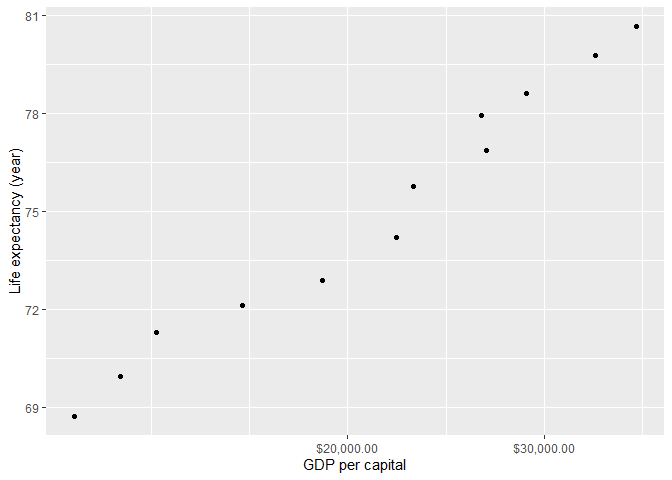
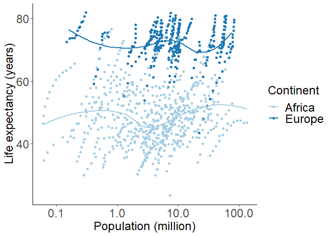
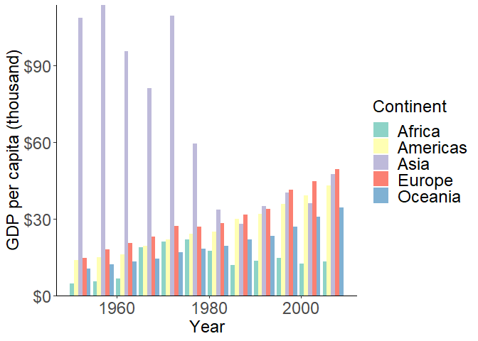

hw\_02\_ggplot\_gapminder
================
Qi Yang
2019/9/23

## Exercise 1

### 1.1 Subseting gapminder to three countries in the 1970’s with `filter()`.

``` r
gapminder %>%
  filter(year > 1969 & year < 1980,
         country == "Italy" | country == "Australia" | country == "Mexico")
```

    ## # A tibble: 6 x 6
    ##   country   continent  year lifeExp      pop gdpPercap
    ##   <fct>     <fct>     <int>   <dbl>    <int>     <dbl>
    ## 1 Australia Oceania    1972    71.9 13177000    16789.
    ## 2 Australia Oceania    1977    73.5 14074100    18334.
    ## 3 Italy     Europe     1972    72.2 54365564    12269.
    ## 4 Italy     Europe     1977    73.5 56059245    14256.
    ## 5 Mexico    Americas   1972    62.4 55984294     6809.
    ## 6 Mexico    Americas   1977    65.0 63759976     7675.

### 1.2 Selecting “country” and “gdpPercap” from 1.1 with `%>%`.

``` r
gapminder %>%
  filter(year > 1969 & year < 1980,
         country == "Italy" | country == "Australia" | country == "Mexico") %>% 
  select(country, gdpPercap)
```

    ## # A tibble: 6 x 2
    ##   country   gdpPercap
    ##   <fct>         <dbl>
    ## 1 Australia    16789.
    ## 2 Australia    18334.
    ## 3 Italy        12269.
    ## 4 Italy        14256.
    ## 5 Mexico        6809.
    ## 6 Mexico        7675.

### 1.3 Adding variable `lifeExpInc` to show filtered entries that have experienced drops in life expectancy with `lag()`.

``` r
gapminder %>% 
  mutate(lifeExpInc = lifeExp-lag(gapminder$lifeExp,1)) %>% 
  filter(lifeExpInc < 0, year != 1952) %>% 
  select(lifeExpInc, everything()) %>% 
  arrange(lifeExpInc)
```

    ## # A tibble: 102 x 7
    ##    lifeExpInc country      continent  year lifeExp       pop gdpPercap
    ##         <dbl> <fct>        <fct>     <int>   <dbl>     <int>     <dbl>
    ##  1     -20.4  Rwanda       Africa     1992    23.6   7290203      737.
    ##  2     -13.6  Zimbabwe     Africa     1997    46.8  11404948      792.
    ##  3     -11.0  Lesotho      Africa     2002    44.6   2046772     1275.
    ##  4     -10.4  Swaziland    Africa     2002    43.9   1130269     4128.
    ##  5     -10.2  Botswana     Africa     1997    52.6   1536536     8647.
    ##  6      -9.10 Cambodia     Asia       1977    31.2   6978607      525.
    ##  7      -7.43 Namibia      Africa     2002    51.5   1972153     4072.
    ##  8      -6.87 South Africa Africa     2002    53.4  44433622     7711.
    ##  9      -6.82 Zimbabwe     Africa     2002    40.0  11926563      672.
    ## 10      -6.05 China        Asia       1962    44.5 665770000      488.
    ## # ... with 92 more rows

### 1.4 Adding `gdpPercapMax` to show the max GDP per capita experienced by each country with `max()`.

``` r
gapminder %>% 
  group_by(country) %>% 
  filter(gdpPercap == max(gdpPercap)) %>% 
  rename(gdpPercapMax = gdpPercap) %>% 
  select(gdpPercapMax, country) %>% 
  arrange(desc(gdpPercapMax))
```

    ## # A tibble: 142 x 2
    ## # Groups:   country [142]
    ##    gdpPercapMax country         
    ##           <dbl> <fct>           
    ##  1      113523. Kuwait          
    ##  2       49357. Norway          
    ##  3       47143. Singapore       
    ##  4       42952. United States   
    ##  5       40676. Ireland         
    ##  6       39725. Hong Kong, China
    ##  7       37506. Switzerland     
    ##  8       36798. Netherlands     
    ##  9       36319. Canada          
    ## 10       36181. Iceland         
    ## # ... with 132 more rows

### 1.5 Scatter plot: Canada’s life expectancy vs. GDP per capita

<!-- -->

## Exercise 2

## Exercise 3

### 3.1 Scatterplot: Life expectancy vs. population in Africa and Europe

    ## `geom_smooth()` using method = 'loess' and formula 'y ~ x'

<!-- -->

### 3.2 Bar plot: GDP per capita vs. year in each continent

<!-- -->
