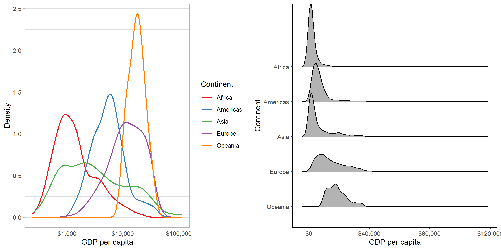
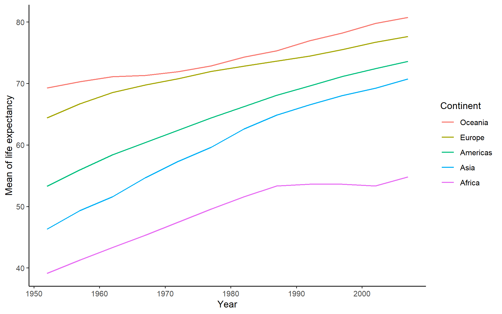

```{r setup, include=FALSE}
knitr::opts_chunk$set(echo = TRUE)
```
```{r load, warning = FALSE, message = FALSE}
library(tidyverse)
library(gapminder)
library(DT)
library(forcats)
library(here)
library(gridExtra)
library(cowplot)
```

## Exercise 1: Value of `here::here`
1.	`here()` makes it easier for collaborators to share their projects. Instead of using an absolute path in the creator's computer, `here()` detects the root directory and works with paths inside it on everyone's computer. So I can download someone else’s project to anywhere in my computer, and easily open any file in the project using `here()`. I don’t need to edit any path when trying to open a file. The only thing I need is a file that signifies the root directory like `.Rproj`, `.here` or something else.
2.	As Rmarkdown sets automatically a local working directory, I can’t import/export a file from/to another sub-directory without typing a bothersome relative path. But `here()` can do that as long as the sub-directory is in the root. Moving a file doesn't require the change of relative directory because `here` works directly from the root.
3.	`Here()` makes it possible to open a `.R` file outside an Rstudio project. Relative paths can’t do that because unlike `here()`, they don’t know where the directory is. 
4.	If there is another working directory inside a project, `here()` won’t be confused as it recognizes project directory first.


## Exercise 2: Factor management (gapminder)

1. Drop Oceania.

1)The variables we are going to use are `continent` and `country`. According to the requirement, I need to ensure that they are factors:
```{r}
class(gapminder$continent)
class(gapminder$country)
```
They are indeed factors.  

2)Now I am going to `filter` the gapminder dataset: remove observations associated with the `continent` of Oceania.     

- Before filtering:    
```{r}
nlevels(gapminder$continent)
levels(gapminder$continent)
nrow(gapminder)
```
There are 5 levels in `continent` and 1704 rows.     

- After filtering:     
```{r}
# create new dataset
gap_filtered_oceania <- gapminder %>% 
              filter(continent != "Oceania")
# count levels and rows
nlevels(gap_filtered_oceania$continent)
levels(gap_filtered_oceania$continent)
nrow(gap_filtered_oceania)
```
There are still 5 levels in `continent` but 1680 rows. It means we did filter out some data but the factor "Oceania" still exists.

3)Now I am going to remove Oceania as an unused factor level.
```{r}
# create new dataset
gap_dropped_oceania <- gap_filtered_oceania %>% 
              droplevels()
# count levels and rows
nlevels(gap_dropped_oceania$continent)
levels(gap_dropped_oceania$continent)
nrow(gap_dropped_oceania)
```
There are only 4 levels in `continent` and 1680 rows. It means we successfully removed some data **and** the factor "Oceania".

2.Reorder the levels of `country`.

In this task, I am going to use the factor `country`. What I aim to do is to see how GDP (= `gdpPercap`*`pop` in `gapminder`) changes over time in the top 5 countries which have the highest GDP in 2019, according to [GDP Ranked by Country 2019](http://worldpopulationreview.com/countries/countries-by-gdp/). 

In the following steps, I am going to compare:

- original data,

- data after`arrange()`, 

- data with releveled factors.

1)Original dataset `gapGDP`.
```{r}
# choose 5 countries
top5gdp <- c("United States", "China", "Japan", "Germany", "India")
# modify gapminder
gapGDP <- gapminder %>% 
  mutate(GDP = gdpPercap*pop/1000000000) %>% # create GDP column
  select(country, GDP, year) %>% # choose variables
  filter(country %in% top5gdp) %>% 
  mutate_if(is.numeric, round) # round the digits of GDP
```

- In tibble:
```{r}
gapGDP %>% 
  DT::datatable()
```

- In plot:
```{r}
ggplot(gapGDP, aes(x = year, y = GDP, # plot before re-leveling
                  color = country)) + 
  geom_line(size = 0.8) +
  labs(x = "Year", y = "GDP (billion dollar)", color = "Country") +
  theme_bw()
```

In both **tibble** and **plot**, countries are listed alphabetically.

2)`gapGDP` after `arrange()`.

- In tibble: 
```{r}
gapGDP_arranged <- gapGDP %>% 
  group_by(country) %>% 
  mutate(maxGDP = max(GDP)) %>% 
  arrange(desc(maxGDP)) %>% 
  select(-maxGDP) 
  DT::datatable(gapGDP_arranged)
```

- In plot:
```{r}
ggplot(gapGDP_arranged,aes(x = year, y = GDP, # plot after arrange()
                  color = country) ) +
  geom_line(size = 0.8) +
  labs(x = "Year", y = "GDP (billion dollar)", color = "Country") +
  theme_bw()
```

We can see that in **tibble**, countries are arranged in a descending order of their maximum GDP (I chose this as the statistical summary). However, in **plot**, countries are not ordered, indicating that `arrange()` can't relevel factors.

3)Re-level factors:
```{r}
ggplot(gapGDP, aes(x = year, y = GDP, # plot after relevling
                  color = fct_reorder2(country, year, GDP, max))) + 
                        # fct_reorder2 is used for 2 variables
  geom_line(size = 0.8) +
  labs(x = "Year", y = "GDP (billion dollar)", color = "Country") +
  theme_bw()
```

After releveling factors, countries are ordered according to their maximum GDP in **plot**!

## Exercise 3: File input/output (I/O)
1. Create something new.      

In this task, I want to see if life expectancies of each continent in the most recent year (2007) varied. I checked maximum values at first, but there isn't much difference. So I tried minimum values.
```{r}
gaplifeExp_con <- gapminder %>% 
                  filter(year == "2007") %>% 
                  group_by(continent) %>% 
                  summarise(lifeExpmin = min(lifeExp))
DT::datatable(gaplifeExp_con)
```

2. Export dataset to disk, and reload it back            

- Export:
```{r}
write_csv(gaplifeExp_con, here::here("hw05","gaplifeExp_con.csv"))
```
- Reload:
```{r}
gaplifeExp_con_re <- read_csv(here::here("hw05", "gaplifeExp_con.csv"),
                              col_names = TRUE, 
                              cols(continent = col_factor()))
                              # To make sure `continent` is a factor
DT::datatable(gaplifeExp_con_re)
```

Comment: I didn't have any difficulty writing the data to file. But I had to add lines when reading the exported data back to file, in order to make `continent`, my future factor, be a real factor. The new file looked just the same as before.    

3. Re-level factors        

- Before re-leveling factors:
```{r}
gaplifeExp_con_re %>%
  ggplot() +
  geom_col(aes(x = continent, y = lifeExpmin)) +
  theme_bw() +
  labs(x = "Continent", y = "Minimum life expectancy")
```

The continents are ordered alphabetically.

- After re-leveling factors:
```{r}
gaplifeExp_con_re %>%
  ggplot() +
  geom_col(aes(x = fct_reorder(continent, lifeExpmin), y = lifeExpmin)) +
  theme_bw() +
  labs(x = "Continent", y = "Minimum life expectancy")
```

The continents are plotted in an ascending order of minimum life expectancy. We can see that there indeed were differences. The lowest life expectancy took place in Africa (< 40 years old), and the highest existed in Oceania (> 80 years old).   

## Exercise 4: Visualization design
I picked 2 plots I had created in my assignment before to modify them.     

1. Changes of life expectancy over time on different continents (Homework03, Task Option 5)
```{r}
hw03_old <- gapminder %>% # old plot
  group_by(continent, year) %>% 
  summarize(min = min(lifeExp),
            mean = mean(lifeExp),
            max = max(lifeExp)) %>% 
  ggplot(aes(year, mean, colour = continent)) +
  geom_line()+
  geom_point()+
  scale_x_continuous("Year")+
  scale_y_continuous("Mean of life expectancy")+
  theme_light()+
  scale_color_brewer(palette="Paired", name = "Continent")

hw03_new <- gapminder %>% # new plot
  group_by(continent, year) %>% 
  summarise(meanlifeExp = mean(lifeExp)) %>% 
ggplot(aes(year, meanlifeExp,
                  color = fct_reorder2(continent, year, meanlifeExp))) + 
  geom_line(size = 0.6) +
  labs(x = "Year", y = "Mean of life expectancy", color = "Continent") +
  theme_classic()
```
```{r, fig.height=5, fig.width=15}
cowplot::plot_grid(hw03_old, hw03_new, ncol = 2, nrow = 1)
```


<center> Changes of life expectancy over time on different continents, old(left) and new (right) </center>

|What I changed|Oldl|New|
|----|--------|---|
|Factor re-leveling| Orders of continents don't match in lines and legend | Matched!|
|Color| Colors are not very easy to differentiate from each other | easier|
|Background|Grids in graph are kind of distractive|White, lines are easier to be seen|
|Points|Could be redundant if readers are only interested in general trends|Removed, trends are more clear|

2. Changes of GDP per capita in each continent over time (Homework 02, Exercise 2)

```{r}
hw02_old <- ggplot(gapminder, aes(gdpPercap, color = continent)) +
  geom_line(stat = "density", size = 0.8) +
  scale_x_log10("GDP per capita", labels = scales::dollar_format())+
  scale_y_continuous("Density")+
  theme_light()+
  scale_color_brewer(palette="Set1", name = "Continent")

hw02_new <- ggplot(gapminder, aes(x = gdpPercap, y = fct_rev(continent)))+
  ggridges::geom_density_ridges()+
  theme_classic()+
  scale_x_continuous("GDP per capita", labels = scales::dollar_format())+
  scale_y_discrete("Continent")
```
```{r, fig.height=5, fig.width=15}
cowplot::plot_grid(hw02_old, hw02_new, ncol = 2, nrow = 1)
```
<center> GDP per capita distribution in different continents, old(left) and new (right)</center>

|What I changed|Old|New|
|----|--------|---|
|Factor re-leveling| Continents are overlapped | Continents are placed  alphabetically|
|Plot type| Continents are overlapped | Continents are separated and easy to be seen|
|Background|Grids in graph are kind of distractive|White, density plots are easier to be seen|
|Color|Multiple colors as `continent` is an aesthetic |Since `continent` becomes the y-axis there is no need for colors. Still works if printed in  black-and-white|


## Exercise 5: Writing figures to file

I would like to save the new plot of "Changes of life expectancy over time on different continents". I don't think I can save the right plot if I don't specify the object by `plot = `, but let's see what R will give us.
```{r}
ggsave(here::here("hw05","new_lifeExp_year_continent.png"), 
       dpi = 250, 
       width = 10,
       height = 5)
```


When I loaded the plot back, I found R by default saved the last plot we had created in the file. Now let's specify the plot object and try again.
```{r}
ggsave(here::here("hw05","real_lifeExp_year_continent.png"), 
       plot = hw03_new,
       dpi = 250, 
       width = 8,
       height = 5)
```


This time, the plot I loadeded is right, so it is important to specify which plot we would like to save.

