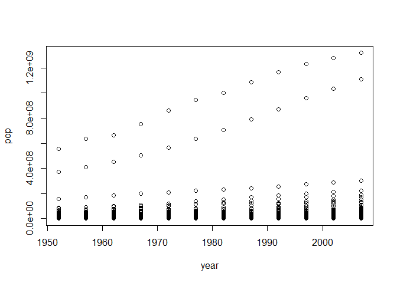

# Exploring Gapminder

## An overview of gapminder

```
## Classes 'tbl_df', 'tbl' and 'data.frame':	1704 obs. of  6 variables:
##  $ country  : Factor w/ 142 levels "Afghanistan",..: 1 1 1 1 1 1 1 1 1 1 ...
##  $ continent: Factor w/ 5 levels "Africa","Americas",..: 3 3 3 3 3 3 3 3 3 3 ...
##  $ year     : int  1952 1957 1962 1967 1972 1977 1982 1987 1992 1997 ...
##  $ lifeExp  : num  28.8 30.3 32 34 36.1 ...
##  $ pop      : int  8425333 9240934 10267083 11537966 13079460 14880372 12881816 13867957 16317921 22227415 ...
##  $ gdpPercap: num  779 821 853 836 740 ...
```
- How many rows does gapminder have?

```
## [1] 1704
```
- How many columns does gapminder have?

```
## [1] 6
```
- What variables does gapminder have?

```
## [1] "country"   "continent" "year"      "lifeExp"   "pop"       "gdpPercap"
```
## Maximum, minimum, mean, range
- What are the maximum, minimum, and mean values of life expectation of all years and of all countries?

```
##    Min. 1st Qu.  Median    Mean 3rd Qu.    Max. 
##   23.60   48.20   60.71   59.47   70.85   82.60
```
- What is the time range of gapminder?

```
## [1] 1952 2007
```
## Extracting information based on certain criteria 
- What if we want to view all records about Afghanistan?

```
## # A tibble: 12 x 6
##    country     continent  year lifeExp      pop gdpPercap
##    <fct>       <fct>     <int>   <dbl>    <int>     <dbl>
##  1 Afghanistan Asia       1952    28.8  8425333      779.
##  2 Afghanistan Asia       1957    30.3  9240934      821.
##  3 Afghanistan Asia       1962    32.0 10267083      853.
##  4 Afghanistan Asia       1967    34.0 11537966      836.
##  5 Afghanistan Asia       1972    36.1 13079460      740.
##  6 Afghanistan Asia       1977    38.4 14880372      786.
##  7 Afghanistan Asia       1982    39.9 12881816      978.
##  8 Afghanistan Asia       1987    40.8 13867957      852.
##  9 Afghanistan Asia       1992    41.7 16317921      649.
## 10 Afghanistan Asia       1997    41.8 22227415      635.
## 11 Afghanistan Asia       2002    42.1 25268405      727.
## 12 Afghanistan Asia       2007    43.8 31889923      975.
```
## Finding out specific information
- Which country has the highest GDP per capita in 1972?

```
## [1] Kuwait
## 142 Levels: Afghanistan Albania Algeria Angola Argentina ... Zimbabwe
```
- When did Afghanistan have the lowest GDP?

```
## [1] 1997
```
## Graphic  
- Population changes of all countries over time  
<!-- -->

